# End-to-End Banking Data Engineering Project

A banking data pipeline that generates synthetic customers, accounts, and transactions, captures PostgreSQL changes with Debezium, streams them through Kafka, and builds analytical models in Snowflake using dbt and Airflow.

The project demonstrates change data capture (CDC), Parquet object storage, incremental warehouse loading, and customer/account history through dbt snapshots. PostgreSQL-to-MinIO streaming runs continuously; Snowflake ingestion and transformations run on scheduled intervals.

## Architecture

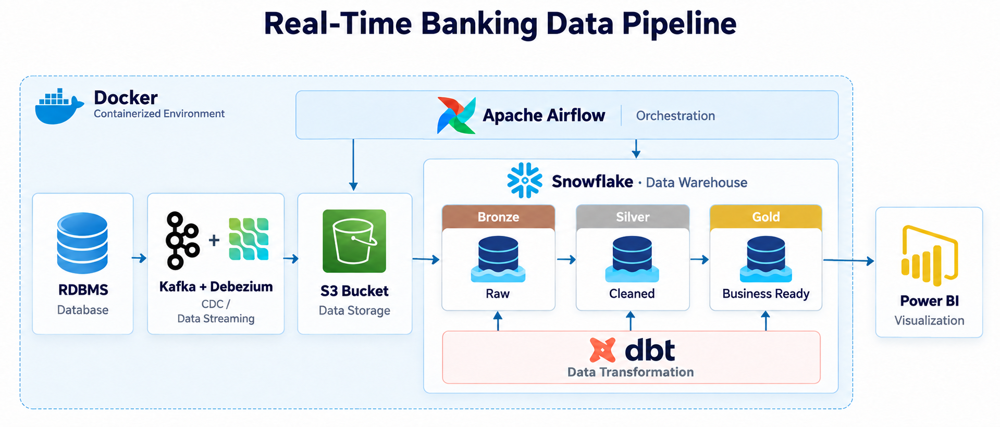

The diagram shows the overall design. In this implementation:

- **PostgreSQL** is the source database.
- **Kafka runs in KRaft mode**, without ZooKeeper.
- **MinIO** provides the S3-compatible object storage shown as an S3 bucket.
- **Snowflake** is an external cloud service. Docker runs PostgreSQL, Kafka, Debezium Connect, MinIO, and Airflow locally.
- **Bronze, silver, and gold** describe the raw events, cleaned staging views, and analytical marts. Staging views, snapshots, and marts share the `ANALYTICS` schema.
- **Power BI** is a planned visualization step; this repository currently builds the pipeline through the Snowflake marts.

### How data moves

1. A Python generator inserts synthetic banking data into PostgreSQL.
2. Debezium takes an initial snapshot, then captures committed inserts, updates, and deletes from PostgreSQL's write-ahead log.
3. Debezium publishes JSON change events to a Kafka topic for each source table.
4. A Python Kafka consumer writes batches of events as Parquet files into MinIO.
5. Airflow loads new events from MinIO into Snowflake raw tables every **5 minutes**.
6. dbt staging views select the latest event for each entity and convert fields to SQL types. Airflow runs dbt snapshots and marts every **7 minutes**.

## Technology stack

| Tool | Role |
| --- | --- |
| Python, Faker, psycopg2 | Synthetic data generation and PostgreSQL writes |
| uv | Python environment and dependency management |
| PostgreSQL 16 | Relational source database with logical replication |
| Apache Kafka 4.3 | Event streaming using KRaft |
| Debezium / Kafka Connect | PostgreSQL change data capture |
| MinIO | S3-compatible storage for Parquet files |
| PyArrow, boto3 | Parquet serialization and object storage access |
| Snowflake | Raw event storage and analytical warehouse |
| dbt | Staging views, snapshots, dimensions, and incremental facts |
| Apache Airflow 2.11 | Scheduled ingestion and transformation |
| Docker Compose | Local service configuration and persistent volumes |

## Project structure

```text
.
├── compose.yaml                         # Local infrastructure
├── pyproject.toml                       # Python dependencies
├── .env.example                         # Configuration template
├── data-generator/
│   └── generate.py                      # Continuous banking data generator
├── postgres/
│   ├── schema.sql                       # Source tables and constraints
│   └── seed.sql                         # Empty initial seed
├── kafka-debezium/
│   └── postgres-connector.json          # PostgreSQL CDC connector
├── consumer/
│   └── kafka_to_minio.py                # Kafka events to Parquet
├── airflow/
│   ├── Dockerfile
│   └── dags/
│       ├── inspect_minio.py             # Inspect MinIO and load Snowflake
│       └── dbt_snapshots_marts_hourly.py # Snapshots and marts: every 7 minutes
├── banking_dbt/
│   ├── dbt_project.yml
│   ├── profiles.yml                     # Reads credentials from environment
│   ├── models/
│   │   ├── sources.yml
│   │   ├── staging/
│   │   └── marts/
│   │       ├── dimensions/
│   │       └── facts/
│   └── snapshots/
├── docs/images/                         # Architecture diagram
└── screenshots/                         # Application screenshots
```

## Synthetic data generator

The generator creates new customers in each batch and continues until stopped. The default is **10 customers per batch**, followed by a **2-second pause**.

| Entity | Generation rules |
| --- | --- |
| Customers | Faker first/last names and unique name-based Gmail addresses; no `created_at` column |
| Accounts | 1–4 per customer, sampled from a bounded rounded normal distribution (mean 2.5, standard deviation 0.8) |
| Transactions | 10–100 per account, sampled from a bounded rounded normal distribution (mean 55, standard deviation 15); includes the opening deposit |
| Account dates | Between January 1, 2020 and the current batch time |
| Transaction dates | Strictly later than the account creation time and no later than the current batch time |
| Money | USD, positive transaction amounts, and nonnegative account balances |

Email addresses use a normalized first/last name followed by a random number, such as `zakariatahiri89@gmail.com`. The suffix is drawn from `0–99` with 50% probability, `0–999` with 25%, and `0–9999` with 25%.

The generator replays deposits, withdrawals, and transfers in chronological order within each batch and saves the resulting balances. Synthetic transaction dates describe historical activity even though the database inserts happen now. Names and email addresses are generated for demonstration purposes.

## Getting started

The commands below use **PowerShell** and run from the repository root.

### 1. Prepare the environment

Requirements: Docker Desktop running with Linux containers, uv, Python 3.13 or newer, and a Snowflake account with an available warehouse.

```powershell
git clone https://github.com/zakariatahi/end-to-end-data-engineering-banking-project.git
cd end-to-end-data-engineering-banking-project
Copy-Item .env.example .env
uv sync --dev
```

`uv sync` creates the local `.venv` and installs the dependencies, including dbt. It also generates a local `uv.lock` when one is absent.

Open `.env` and fill in:

```dotenv
SNOWFLAKE_ACCOUNT=your-account-identifier
SNOWFLAKE_USER=your-username
SNOWFLAKE_PASSWORD=your-password
SNOWFLAKE_WAREHOUSE=your-warehouse
```

Use the account identifier accepted by the Snowflake connector, without `https://` or `.snowflakecomputing.com`. PostgreSQL and MinIO development settings are provided in `.env.example`. Keep `.env` local; it is excluded by `.gitignore`.

The dbt profile targets `BANKING.ANALYTICS` and currently uses `ACCOUNTADMIN`. Adjust the role in [profiles.yml](banking_dbt/profiles.yml) for your account and grant the permissions needed to create and query the project objects.

### 2. Prepare Snowflake

Run this SQL in a Snowflake worksheet using a role with the necessary permissions:

```sql
CREATE DATABASE IF NOT EXISTS BANKING;
CREATE SCHEMA IF NOT EXISTS BANKING.RAW;
CREATE SCHEMA IF NOT EXISTS BANKING.ANALYTICS;

CREATE TABLE IF NOT EXISTS BANKING.RAW.CUSTOMERS (V VARIANT);
CREATE TABLE IF NOT EXISTS BANKING.RAW.ACCOUNTS (V VARIANT);
CREATE TABLE IF NOT EXISTS BANKING.RAW.TRANSACTIONS (V VARIANT);
```

Each raw table stores an event row in a single `V` column. dbt creates the staging views, snapshots, and marts later.

### 3. Start the infrastructure

```powershell
docker compose up -d --build
docker compose ps
```

On a fresh installation, open Airflow and **pause `dbt_snapshots_marts_hourly` until step 6 is complete**. Keep `inspect_banking_minio` paused until the consumer has uploaded its first files, then unpause it for ingestion.

Airflow standalone creates an `admin` user. Retrieve its generated password locally with:

```powershell
docker compose exec airflow cat /opt/airflow/standalone_admin_password.txt
```

PostgreSQL initialization SQL runs only when its Docker volume is first created. Editing `postgres/schema.sql` does not migrate an existing database.

### 4. Register the Debezium connector

Wait for Kafka Connect to respond, then register the connector once:

```powershell
curl.exe --fail-with-body -X POST http://localhost:8083/connectors -H "Content-Type: application/json" --data-binary "@kafka-debezium/postgres-connector.json"
```

Check its status:

```powershell
curl.exe --silent --show-error http://localhost:8083/connectors/banking-postgres/status
```

The connector and its task should report `RUNNING`. An HTTP `409` during registration means a connector with that name already exists; check its status before registering again.

### 5. Start the consumer and generator

In one terminal, start the Kafka-to-MinIO consumer:

```powershell
uv run python consumer/kafka_to_minio.py
```

In a second terminal, start the data generator:

```powershell
uv run python data-generator/generate.py
```

Both scripts load the root `.env`. Keep both terminals open while streaming. Press **Ctrl+C** in the relevant terminal to stop a script.

For a small initial batch, use:

```powershell
uv run python data-generator/generate.py --once --customers 10 --seed 42
```

You can change continuous generation with `--customers` and `--interval`, for example `--customers 5 --interval 10`.

The consumer creates the `banking-cdc` bucket if needed and uploads batches of up to 50 events, flushing pending events after about 5 seconds. In Airflow, unpause and trigger `inspect_banking_minio`, then wait for a successful load before continuing.

### 6. Initialize dbt models

Run these commands in order after the first Snowflake raw load succeeds:

```powershell
uv run --env-file .env dbt debug --project-dir banking_dbt --profiles-dir banking_dbt
uv run --env-file .env dbt run --project-dir banking_dbt --profiles-dir banking_dbt --select stg_customers stg_accounts stg_transactions
uv run --env-file .env dbt snapshot --project-dir banking_dbt --profiles-dir banking_dbt
uv run --env-file .env dbt run --project-dir banking_dbt --profiles-dir banking_dbt --select dim_customers dim_accounts fact_transactions
```

Unpause `dbt_snapshots_marts_hourly` in Airflow. It will then run snapshots followed by marts every 7 minutes. Staging models are views, so they read newly loaded raw events without being rebuilt on each scheduled run. Rerun the staging command whenever you change their SQL.

## Local service addresses

| Service | Address | Access |
| --- | --- | --- |
| Airflow | http://localhost:8080 | `admin` and the generated standalone password |
| MinIO console | http://localhost:9001 | `MINIO_ACCESS_KEY` and `MINIO_SECRET_KEY` from `.env` |
| MinIO API | http://localhost:9000 | S3-compatible endpoint |
| Kafka Connect | http://localhost:8083 | Connector REST API |
| Kafka broker | `localhost:9092` | Kafka clients; no web UI is configured |
| PostgreSQL | `localhost:5434` | Database/user `banking`; password from `.env` |
| Snowflake | Your Snowflake account | Cloud warehouse accessed through Snowsight or connectors |

To browse PostgreSQL in pgAdmin, register a server with host `localhost`, port `5434`, database `banking`, user `banking`, and the password from `.env`. pgAdmin is installed separately from the Compose services.

## Airflow orchestration

| DAG | Configured interval | Task order |
| --- | --- | --- |
| `inspect_banking_minio` | 5 minutes | Count Parquet files → load transactions → load accounts → load customers |
| `dbt_snapshots_marts_hourly` | 7 minutes | Run snapshots → run marts |

The second DAG keeps its original `hourly` name, but its current interval is **7 minutes**. Both DAGs disable catchup and allow one active run each. Their schedules are independent, so dbt uses the raw data available when its tasks execute.

## Data formats and warehouse models

### Kafka and MinIO

Debezium produces JSON envelopes containing `before`, `after`, `op`, and source metadata. Operation codes include `r` (initial snapshot), `c` (insert), `u` (update), and `d` (delete).

The consumer extracts the row and adds `_op`, `_source_ts_ms`, and `_kafka_offset`. It stores Parquet objects using this layout:

```text
banking-cdc/
├── customers/date=YYYY-MM-DD/partition=0/<first-offset>-<last-offset>.parquet
├── accounts/date=YYYY-MM-DD/partition=0/<first-offset>-<last-offset>.parquet
└── transactions/date=YYYY-MM-DD/partition=0/<first-offset>-<last-offset>.parquet
```

The folder date is the upload date. Historical transaction dates remain inside the records. Kafka offsets identify events within a topic partition; they are separate from customer, account, and transaction IDs.

The consumer commits offsets after a successful upload. The Snowflake loader checks event offsets against the maximum already loaded for each table and validates continuity before appending new events.

### Snowflake layers

| Layer | Objects | Purpose |
| --- | --- | --- |
| Raw / bronze | `BANKING.RAW.CUSTOMERS`, `ACCOUNTS`, `TRANSACTIONS` | CDC event rows in a `V VARIANT` column |
| Staging / silver | `BANKING.ANALYTICS.STG_CUSTOMERS`, `STG_ACCOUNTS`, `STG_TRANSACTIONS` | Latest row per source ID, typed fields, deleted rows excluded |
| History | `BANKING.ANALYTICS.CUSTOMERS_SNAPSHOT`, `ACCOUNTS_SNAPSHOT` | Track customer/account changes using dbt's check strategy |
| Marts / gold | `BANKING.ANALYTICS.DIM_CUSTOMERS`, `DIM_ACCOUNTS`, `FACT_TRANSACTIONS` | Historical dimensions and an incremental transaction fact table |

Snapshots record the state observed when dbt runs. If a row changes multiple times between runs, the snapshot captures the state visible at the next run. Raw events retain the intervening changes.

Dimensions expose `effective_from`, `effective_to`, and `is_current`. Filter dimensions to `is_current = TRUE` when joining facts to current customer/account details. The transaction fact uses `transaction_id` as its merge key and exposes the source transaction `created_at` as `transaction_time`.

## Check that the pipeline is working

### Source database

```powershell
docker compose exec -T postgres psql -U banking -d banking -c "SELECT 'customers' AS entity, COUNT(*) FROM customers UNION ALL SELECT 'accounts', COUNT(*) FROM accounts UNION ALL SELECT 'transactions', COUNT(*) FROM transactions;"
```

Run it again while the generator is active; the counts should increase.

### Kafka and CDC

```powershell
docker compose ps kafka connect
curl.exe --silent --show-error http://localhost:8083/connectors/banking-postgres/status
docker compose exec -T kafka /opt/kafka/bin/kafka-topics.sh --bootstrap-server kafka:19092 --list
docker compose exec -T kafka /opt/kafka/bin/kafka-get-offsets.sh --bootstrap-server kafka:19092 --topic 'banking_server.public.*'
```

The three data topics are `banking_server.public.customers`, `banking_server.public.accounts`, and `banking_server.public.transactions`. Offsets should increase while changes are captured. Event counts can exceed source row counts because updates also produce events.

### Storage and transformations

Look for new Parquet files in MinIO, successful tasks in Airflow, and rows in Snowflake:

```sql
SELECT V FROM BANKING.RAW.CUSTOMERS LIMIT 10;

SELECT *
FROM BANKING.ANALYTICS.DIM_CUSTOMERS
WHERE IS_CURRENT = TRUE
LIMIT 10;

SELECT *
FROM BANKING.ANALYTICS.FACT_TRANSACTIONS
ORDER BY TRANSACTION_TIME DESC
LIMIT 10;
```

## Project screenshots

These screenshots show the applications and generated data during a running session. Counts differ between captures as new data continues to arrive.

<details>
<summary>Docker containers</summary>

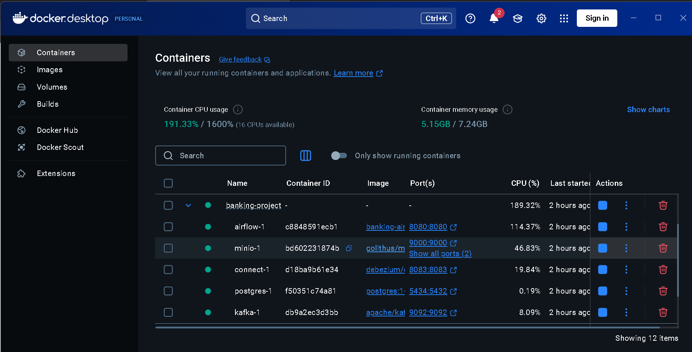

</details>

<details>
<summary>PostgreSQL source tables in pgAdmin</summary>

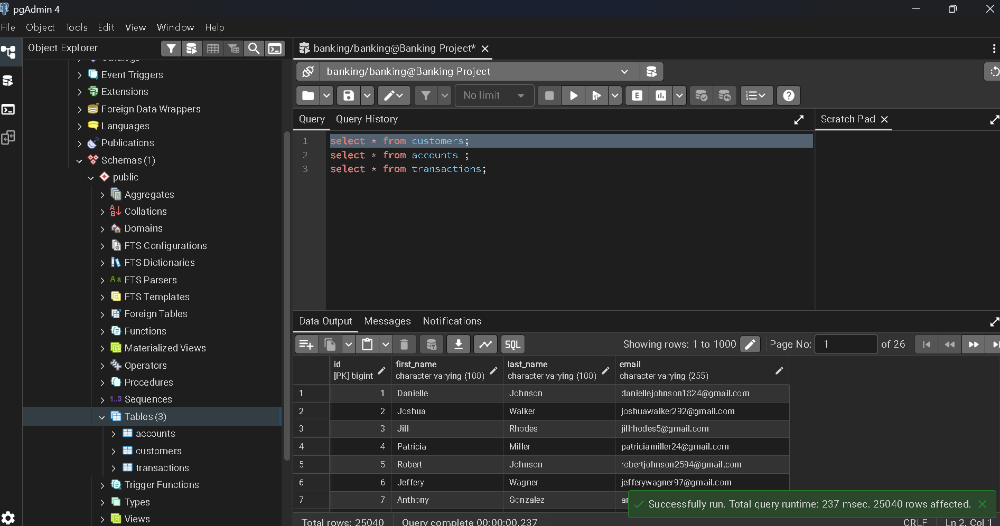

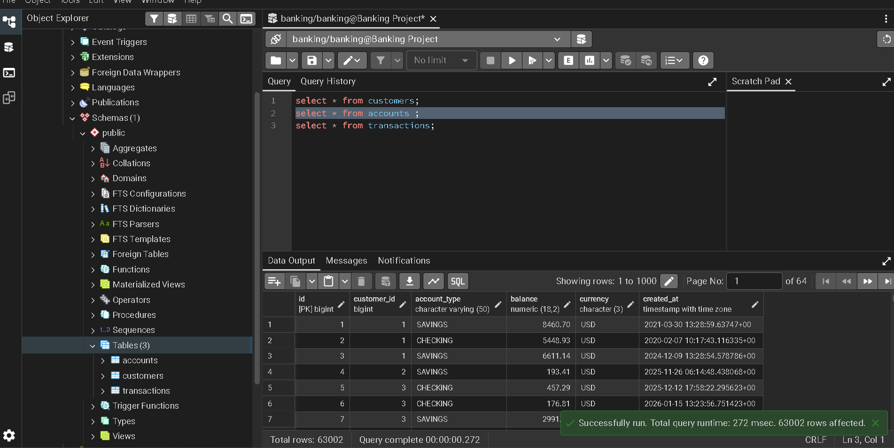

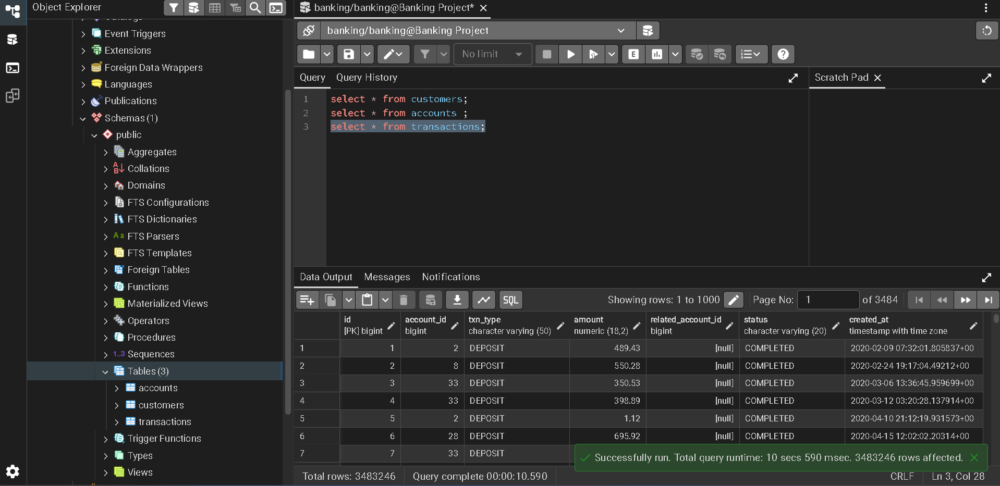

</details>

<details>
<summary>Kafka consumer uploads</summary>

The terminal shows the Kafka consumer writing event batches to MinIO.

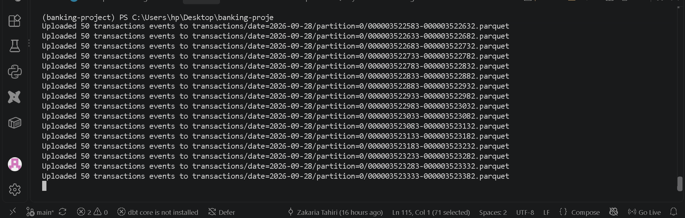

</details>

<details>
<summary>MinIO bucket and Parquet files</summary>

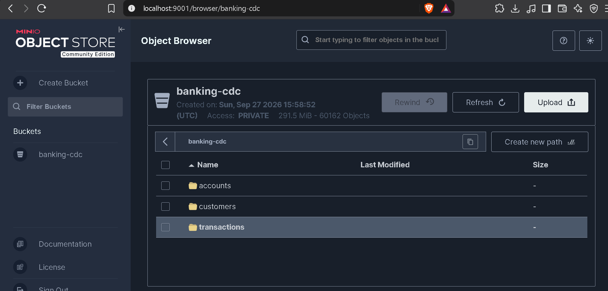

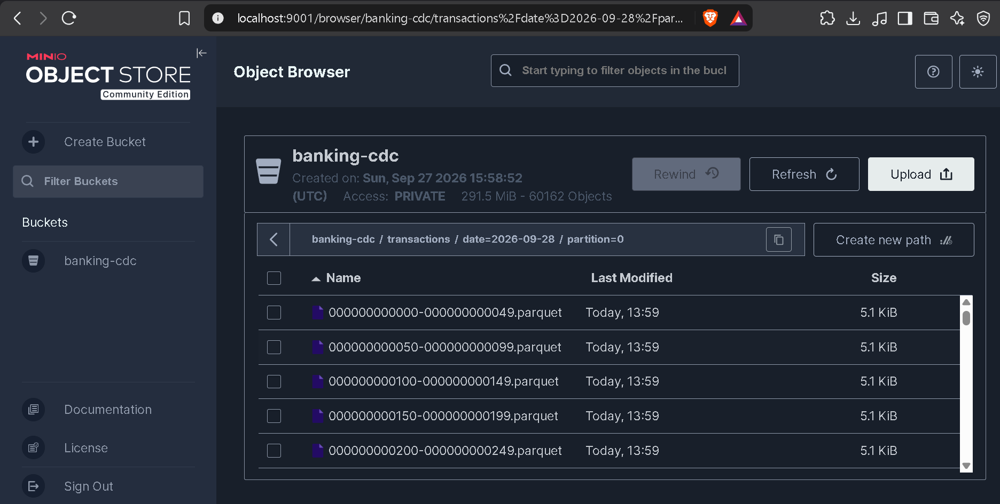

</details>

<details>
<summary>Airflow DAGs and schedules</summary>

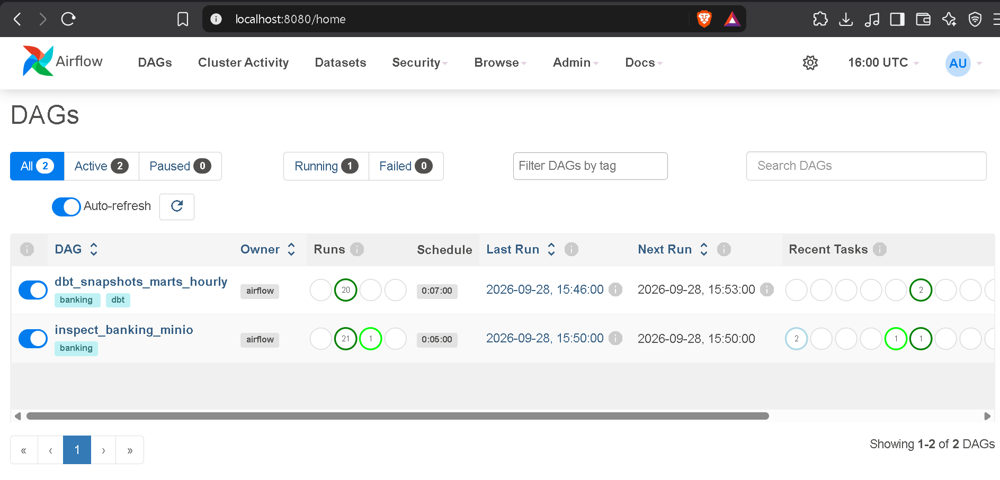

</details>

<details>
<summary>Snowflake raw tables, staging views, and marts</summary>

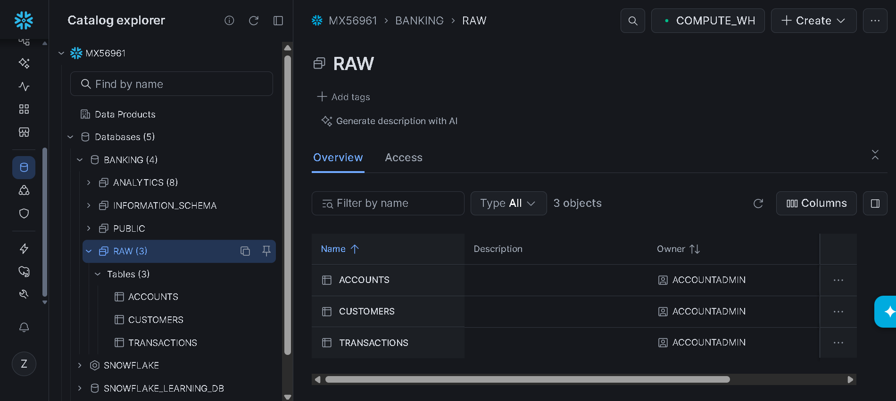

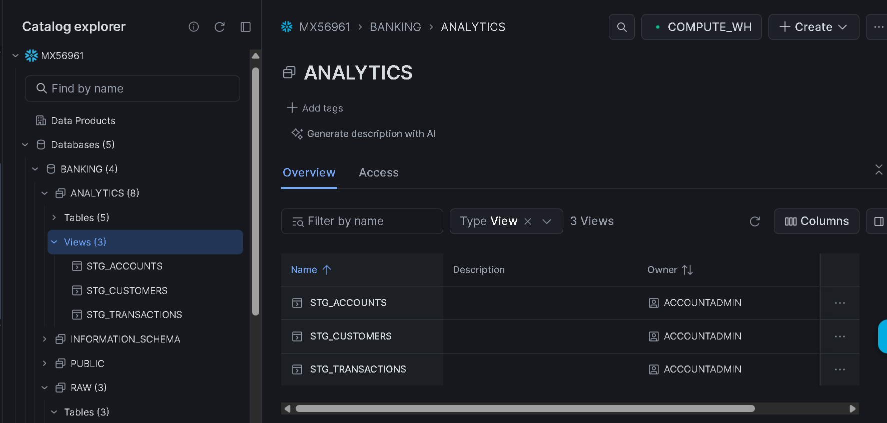

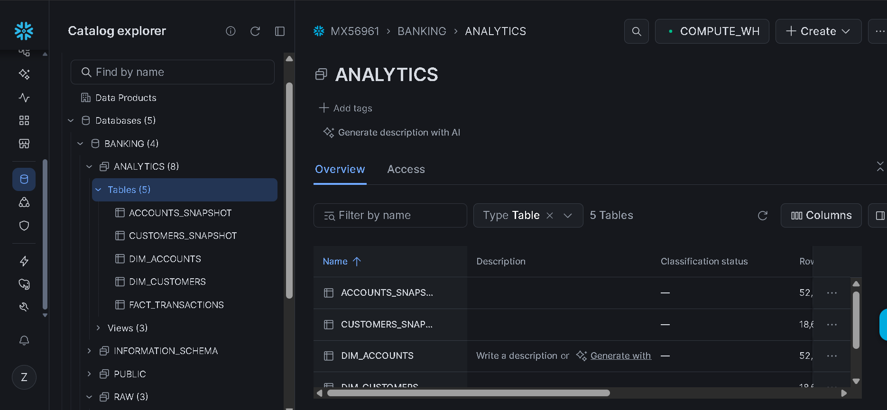

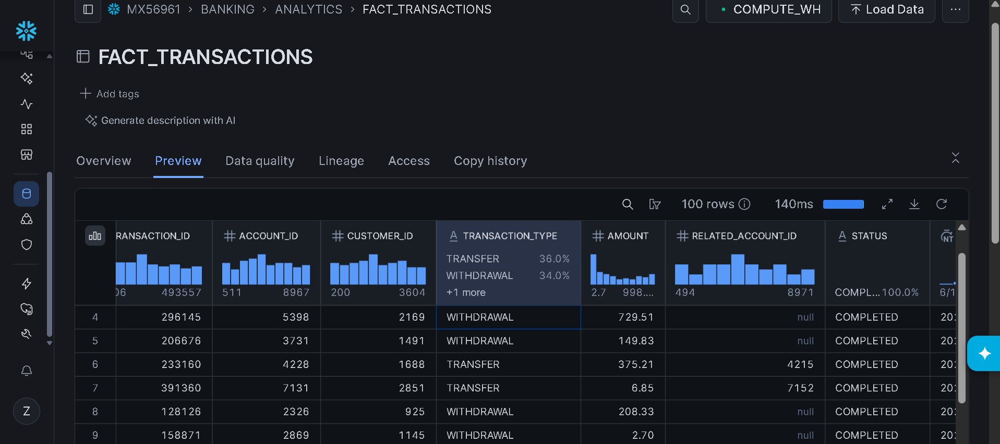

</details>

## Operational notes and next improvements

- **Local development:** Airflow uses standalone mode with SQLite and `SequentialExecutor`. Long ingestion tasks can delay other tasks and scheduler heartbeats; the 5/7-minute intervals do not guarantee that runs finish within those intervals.
- **Ingestion scale:** The loader currently scans existing Parquet files and supports partition `0`. Multiple Kafka partitions and a file manifest/checkpoint would require changes to the loader.
- **Fact maintenance:** Incremental processing merges transaction events above the stored maximum offset. Removing previously loaded transactions or changing account ownership requires rebuilding the fact table to reflect those changes:

  ```powershell
  uv run --env-file .env dbt run --project-dir banking_dbt --profiles-dir banking_dbt --select fact_transactions --full-refresh
  ```

- **Retention:** Continuous generation grows PostgreSQL, Kafka, and MinIO storage. Pause the generator when you finish experimenting.
- **Persistence:** `docker compose down` stops the infrastructure while retaining named volumes. Stop the host generator and consumer separately with Ctrl+C.
- **Planned additions:** Power BI dashboards, automated data quality tests, CI/CD, and a deployment configuration for a production environment.


